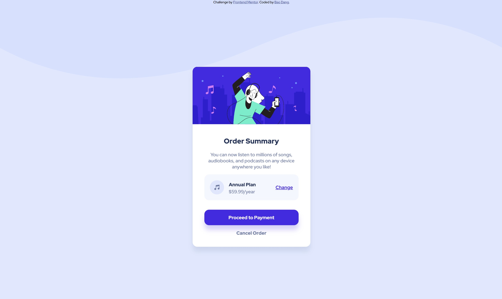

# Frontend Mentor - Order Summary Component Main
## Table of contents

- [Overview](#overview)
  - [Screenshot](#screenshot)
  - [Links](#links)
- [My process](#my-process)
  - [Built with](#built-with)
- [Author](#author)

## Overview

- This is my first ever front end project.

### Screenshot

### Links

- Solution URL: [Solution Site](https://www.frontendmentor.io/solutions/eyeballed-mediocre-replicate-using-flexbox-no_P9t1mq)
- Live Site URL: [Live Site](https://weebao.github.io/order-summary-component-main/)

## My process

- I didn't know how to center a div in the middle of a screen, so I looked up and found several ways to do it.
- I spent quite a while looking up CSS attributes and adjust them to look at close to the design as possible.
- I encountered one challenge which was to organize the elements side by side with some gap between them, which also took me a while as I started learning how to use flexbox.

### Built with

- HTML
- CSS

## Author

- Website - [Bao Dang](https://github.com/weebao)
- Frontend Mentor - [@BaoDang](https://www.frontendmentor.io/profile/weebao)
